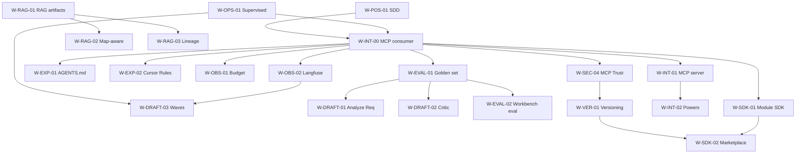

# Agents Workshop — Análise Consolidada de Fortalecimento

> **Para:** agente implementador (Cursor / Claude Code / Gemini CLI) e time de produto
> **Tipo:** diretriz técnica + roadmap consolidado — não é backlog Jira pronto
> **Versão:** consolidação de `STRENGTHENING_ANALYSIS` original (W-01..W-10) + `kiro-analysis` (camadas e capacidades AWS Kiro) + `biatech-sugestoes` (roadmap BIA Tech Bradesco)
> **Premissa:** leitor já conhece `docs/SPEC.md`, `docs/IMPLEMENTATION_PLAN.md` e o estado atual do código em `packages/core`, `packages/cli`, `packages/web`
> **Versão anterior preservada em:** `docs/STRENGTHENING_ANALYSIS.previous.md`

---

## 0. Como usar este documento

Este doc combina três fontes (Workshop original, Kiro, BIA Tech) em **uma única visão**, organizada por:

1. **Princípio transversal** (HITL supervisionado) que se aplica a tudo
2. **5 camadas conceituais** (núcleo, ações, contexto, orquestração, padrões de uso) — vocabulário herdado da análise Kiro
3. **4 horizontes de entrega** (H0/H1/H2/H3), cada um agrupando itens com prefixo temático
4. **Lista do que NÃO mergir** com justificativa explícita

Cada item de horizonte traz: **O quê** · **Por que** · **Onde encaixa** · **Aceitação** · **Origem** (Workshop / Kiro / BIA Tech) · **Adições incorporadas** dos outros docs.

> **Importante:** não tratar como backlog imutável. A ordem dentro de cada horizonte é negociável; a divisão entre horizontes reflete dependências reais (eval antes de mudar prompts, observabilidade antes de subagentes, etc.).

---

## 1. Princípio transversal: **HITL Supervisionado**

> **Workshop nunca opera em modo totalmente automático.** Agentes propõem; humanos aprovam. Mesmo gates "leves" existem em todo fluxo crítico.

Esse princípio condiciona toda escolha de design abaixo e está listado também na seção "O que NÃO mergir".

### Tabela de níveis de risco (inspirada em BIA Tech S-23)

| Nível | Comportamento | Exemplos |
|:---:|---|---|
| **N1** | Agente executa, **notifica e segue** | Ler artifact, gerar preview de design, calcular métrica |
| **N2** | Agente executa, **notifica e aguarda confirmação reversível** | Salvar draft de skill (botão desfazer disponível), criar snapshot de versão |
| **N3** | Exige **aprovação nomeada** antes de executar | Publicar cards em Jira, abrir PR, transicionar status, executar migração em ambiente |
| **N4** | **Humano-first sempre** | Sign-off de AC, cutover de migração, edição de regra de negócio publicada, deploy em produção |

### Consequências práticas no roadmap

- `W-OPS-01` deixa de ser "Autopilot vs Supervised toggle" e vira **"Modo Supervised formalizado com níveis"**
- `W-DRAFT-03` (parallel drafts) entra em **fila aprovável em lote**, não publica direto
- `W-OPS-02` (sandbox/dry-run) é **default N2**, não opcional
- `W-INT-01` (MCP server): tools que mutam estado retornam pendência aguardando confirmação
- `W-INT-00` (consumir MCPs externos): cada tool de MCP herda `risk_level` declarado no `mcp.config.json` — read-only N1, mutating N3
- Hooks do tipo `Agent Stop → execute shell` sem confirmação ficam **proibidos por design**

---

## 2. Framework conceitual: 5 camadas

```
┌─────────────────────────────────────────────────┐
│  5. Padrões de uso (SDD, AI-Native Engineering) │
├─────────────────────────────────────────────────┤
│  4. Orquestração e padrões (workflows, multi-)  │
├─────────────────────────────────────────────────┤
│  3. Contexto e memória (Skills, Specs, Rules)   │
├─────────────────────────────────────────────────┤
│  2. Capacidades de ação (Tools, MCP, RAG)       │
├─────────────────────────────────────────────────┤
│  1. Núcleo (modelo, prompt, tipos, eval)        │
└─────────────────────────────────────────────────┘
```

**Workshop hoje:** forte em 3, 4 e 5. Gaps em 1 (eval) e 2 (MCP, RAG real, sandbox).

**Prefixos temáticos** (substituem a numeração linear W-01..W-10 anterior):

| Prefixo | Tema | Camada principal |
|---|---|---|
| `W-EVAL-*` | Eval automatizado, golden set, métricas de qualidade | 1 |
| `W-OBS-*` | Observabilidade, custo, latência, traces | 1 |
| `W-INT-*` | Integração externa nos **dois sentidos**: **consumir** MCPs públicos (`W-INT-00`) e **expor** Workshop como MCP (`W-INT-01/02`); exports e hooks | 2 |
| `W-RAG-*` | Recuperação semântica sobre artifacts, código, lineage | 2 |
| `W-DRAFT-*` | Capacidades de drafting: critic, parallel, subagentes | 4 |
| `W-EXP-*` | Export de contexto: AGENTS.md, Cursor Rules, foundation | 3 |
| `W-VER-*` | Versionamento de prompts, skills, cards, decisões | 3 |
| `W-SEC-*` | Segurança: secrets, PII, masking, sandboxing | 1, 2 |
| `W-OPS-*` | Operação supervisionada, explicabilidade, governance | 4 |
| `W-SDK-*` | SDK de módulos, marketplace, team scope | 4, 5 |
| `W-POS-*` | Posicionamento e documentação (SDD) | 5 |

---

## 3. Estado atual — leitura honesta

### Pontos fortes já implementados

1. **Discovery estruturado em 4 canais** (`ProjectContext` §4.5 do SPEC)
2. **`tech_panorama` com `role`** (target/legacy/must_avoid/tbd)
3. **5 prompts com schemas Pydantic explícitos**
4. **`llm_runs` como audit log completo** (§6.5)
5. **16 validators determinísticos** (§9)
6. **Workflow determinístico, não agente autônomo** — alinhado com o princípio HITL
7. **3 PoCs reais como few-shot** (Caixa-2, Enel, VLI)
8. **Async via Dramatiq desde MVP** (§7a + §8)
9. **Migration Workbench com 11 estágios** (`packages/core/app/modules/migration_workbench/`) — Profiles · Registry · Context · Documentation · Analysis · **Map** · Propagation · Generation · Reconciliation · Sign-off · Skills
10. **Map de migração já implementado** (source-platform, NetworkX, clusters, waves, object registry) — `migration_workbench/map/`

### Gaps relevantes (consolidados das três fontes)

| Gap | Origem | Endereçado em |
|---|---|---|
| Sem golden set / eval automatizado | Workshop W-01 + BIA S-05/S-21 + Kiro§eval | **H0 · W-EVAL-01** |
| Sem observabilidade unificada (custo + latência + traces) | BIA S-06 + Kiro + Workshop | **H0 · W-OBS-01/02** |
| **Workshop reinventa capabilities que já existem como MCPs públicos** (skill p/ GitHub, Jira, Postgres, filesystem etc. quando MCP oficial já entrega) | Análise interna (skills geradas vs MCPs maduros) | **H0 · W-INT-00** |
| Sem MCP server expondo capacidades próprias | Workshop W-02 + Kiro§MCP + BIA S-24 | **H3 · W-INT-01/02** |
| Sem governança de supply chain de MCPs consumidos (quais aprovados, qual versão, qual sandbox) | Decorrente de W-INT-00 + princípio HITL | **H2 · W-SEC-04** |
| Artifacts inline (head/tail) — sem RAG | Workshop W-03 + Kiro tree-sitter + BIA D-12 | **H1 · W-RAG-01** |
| Drafts sequenciais, sem critic, sem subagentes isolados | Workshop W-04/W-05 + Kiro subagents/waves | **H1 · W-DRAFT-01/02/03** |
| Sem export AGENTS.md, foundation steering, Cursor Rules | Workshop W-08 + Kiro AGENTS.md + Kiro steering | **H0 · W-EXP-01/02** |
| Sem versionamento de prompts/skills/cards | Workshop W-09 + BIA S-22 GitOps + Kiro Rewind | **H2 · W-VER-01** |
| Sem secrets vault, PII detector, data masking | BIA D-27/D-28 + Kiro AWS SM | **H2 · W-SEC-01/02/03** |
| Sem explicabilidade do raciocínio | Kiro Thinking tool + obrigação regulatória | **H2 · W-OPS-03** |
| Sem SDK formal para novos módulos como Migration Workbench | Workshop interno + Kiro custom subagents | **H3 · W-SDK-01** |
| Sem reuso cross-projeto (marketplace) | Workshop W-07 + Kiro team scope | **H3 · W-SDK-02** |
| Sem posicionamento explícito como ferramenta SDD | Workshop W-10 + Kiro adota SDD | **H0 · W-POS-01** |

---

# 4. Roadmap consolidado por horizonte

## Horizonte 0 — Fundações (não-negociáveis)

Sem H0, qualquer mudança em prompts é especulação e qualquer integração externa é insegura.

### `W-INT-00` — MCP Awareness (Workshop como **consumidor** de MCPs públicos)

**O quê.** Workshop passa a tratar **MCPs públicos como cidadãos de primeira classe**, não competidores das Skills. Três adições:

1. **Catálogo curado de MCPs conhecidos** (`packages/core/app/mcp_catalog/`) com metadata: nome, vendor, versão pinada, capabilities, nível de trust, run command, env vars exigidas, `risk_level` por tool exposta.
2. **Novo prompt `RecommendMCPs(project_context)`** que, dado `tech_panorama` + objetivos + artifacts, sugere MCPs do catálogo relevantes ao projeto (com motivo). Análogo ao "Powers" do Kiro, mas como **consumidor**.
3. **`ProposeSkillSet` refinado** — antes de propor uma skill `instructional` para uma capability, verifica se algum MCP recomendado já cobre. Se sim, marca a skill como `kind='context_only'` (só conhecimento de domínio; "como fazer" delegado ao MCP).
4. **Export emite `mcp.config.json`** (formato neutro) + `.cursor/mcp.json` (formato Cursor) ao lado de `skills/`.

**Por que.** Skill gerada é markdown em prosa; MCP oficial é código testado. Para capabilities **horizontais** (GitHub, Jira, Postgres, filesystem, Slack, Confluence, Notion, AWS-read, Sentry, web fetch, git local, memory), MCP entrega **maior qualidade com menor manutenção**. Skills devem se concentrar em **conhecimento vertical do projeto** (regras de negócio do cliente, convenções de código legado, padrões de tradução SSIS→Airflow específicos).

**Onde encaixa.**
```
packages/core/app/
├── mcp_catalog/                    # NOVO
│   ├── __init__.py
│   ├── entries/                    # YAML por MCP conhecido
│   │   ├── github.yaml
│   │   ├── jira-atlassian.yaml
│   │   ├── postgres.yaml
│   │   ├── filesystem.yaml
│   │   └── ...
│   ├── loader.py                   # parse + validate entries
│   └── service.py                  # query, filter, render mcp.config.json
├── prompts/
│   └── recommend_mcps.py           # NOVO prompt
└── exporters/
    └── mcp_config.py               # NOVO
```

Nova tabela:
```sql
CREATE TABLE project_mcps (
  project_id UUID REFERENCES projects(id) ON DELETE CASCADE,
  mcp_key TEXT NOT NULL,            -- chave do catálogo
  enabled BOOLEAN NOT NULL DEFAULT TRUE,
  config_json JSONB NOT NULL,        -- env vars, args customizados
  recommended_by TEXT,               -- 'llm' | 'user' | 'team_default'
  approved_by TEXT,
  approved_at TIMESTAMPTZ,
  PRIMARY KEY (project_id, mcp_key)
);
```

**Aceitação.**
- Catálogo inicial com **mínimo 12 MCPs** (GitHub, Jira, Postgres, Filesystem, Slack, Confluence, Notion, AWS-read, Sentry, fetch, git, memory)
- Cada entry valida contra schema Pydantic `MCPCatalogEntry`
- `RecommendMCPs` retorna lista estruturada com `mcp_key`, `reason`, `confidence`, `would_replace_skill` (slug da skill que ficaria redundante)
- UI: tela `/projects/[slug]/mcps` lista recomendados + custom; humano aprova quais entram no `mcp.config.json` (N3)
- Export gera `mcp.config.json` válido + `.cursor/mcp.json` válido
- Skills com `kind='context_only'` não contêm instruções operacionais de capabilities cobertas por MCPs ativos do projeto
- CLI: `workshop mcp recommend`, `workshop mcp list`, `workshop mcp enable <key>`

**Origem.** Análise interna (insight: skills vs MCPs trade-off).
**Adições incorporadas.** Kiro§powers (consumido, não produzido) + comunidade MCP 2026 (servidores oficiais existentes).
**Cross-impact.** Vide §4.5 Matriz transversal.

---

### `W-EVAL-01` — Golden set + eval automatizado dos 5 prompts

**O quê.** Conjunto versionado de inputs/outputs esperados para cada um dos 5 prompts (`ProposeSkillSet`, `DraftSkillBody`, `ProposeBacklog`, `DraftCard`, `SuggestTechStack`), com pipeline que executa o conjunto e mede regressão quando o prompt muda.

**Por que.** `SPEC.md §7` define schemas precisos mas não define **o que é um output bom**. Alterar `propose_backlog.py` hoje é especulação.

**Onde encaixa.**
```
packages/core/app/
├── eval/                          # NOVO
│   ├── fixtures/                  # input/output golden por prompt (3+ por prompt)
│   ├── runners.py                 # executa fixtures
│   ├── metrics.py                 # similaridade estrutural, cobertura de campos
│   └── reports.py                 # markdown report + diff
└── tests/eval/test_prompts.py     # @pytest.mark.eval
```
CLI: `workshop eval run [--prompt KIND] [--mock]`.

**Aceitação.**
- 3+ fixtures por prompt, ancoradas nas 3 PoCs seedadas
- **Inclui fixtures para `RecommendMCPs`** (W-INT-00): dado contexto X, MCPs esperados = [...]
- Métricas estruturais: parsing success rate, cobertura de campos críticos, diff por propriedades (não bytewise)
- **Métrica visualizada na UI**: gráfico temporal de assertividade por prompt (BIA S-21)
- **Bloqueio soft de promoção** quando score caiu vs versão anterior (BIA S-21)
- Modo `--mock` com fixtures cacheadas para CI rápido

**Origem.** Workshop W-01.
**Adições incorporadas.** BIA S-05 ("30-50 casos input/output") + BIA S-21 (visualização histórica) + Kiro§eval (gap reconhecido).

---

### `W-OBS-01` — Budget enforcement + métricas operacionais

**O quê.** Tabela e endpoint que enforça ceiling de custo por projeto/squad/tenant, com alertas para latência p95 e taxa de falha de tool call.

**Por que.** `llm_runs` registra custo, mas não há **ceiling** nem alerta de degradação.

**Onde encaixa.**
```sql
CREATE TABLE budget_limits (
  scope TEXT NOT NULL,          -- 'project' | 'squad' | 'tenant'
  scope_id UUID NOT NULL,
  monthly_usd NUMERIC(10,2) NOT NULL,
  alert_threshold_pct INT DEFAULT 80,
  hard_block BOOLEAN DEFAULT FALSE
);
```

**Aceitação.**
- Quando consumo atinge `alert_threshold_pct`, notificação enviada
- Quando atinge 100% com `hard_block=TRUE`, novas chamadas LLM retornam 402 Payment Required
- Métricas computadas e expostas: custo, **latência p95**, **% de falha de parse Pydantic**, **% de tool call falha**
- **Custo inclui tool calls de MCPs externos pagos** (search MCPs, LLM-driven MCPs) — W-INT-00
- Breakdown por **projeto, squad, agente, MCP** (não só por projeto)

**Origem.** Workshop interno + STRENGTHENING W-13 (proposta anterior).
**Adições incorporadas.** BIA S-06 (latência p95, tool call falha).

---

### `W-OBS-02` — Observabilidade via Langfuse

**O quê.** Write-through dos `llm_runs` para Langfuse self-hosted, com traces preparados para subagentes.

**Por que.** Não reinventar dashboard de LLM ops; Langfuse é o padrão de mercado e BIA S-06 nomeia explicitamente.

**Onde encaixa.** Service novo `packages/core/app/services/langfuse_writer.py`; configurar via env `LANGFUSE_HOST`, `LANGFUSE_PUBLIC_KEY`, `LANGFUSE_SECRET_KEY`. Langfuse self-hosted no docker-compose como serviço opcional.

**Aceitação.**
- Todo `llm_runs` espelhado em Langfuse com `trace_id` correlacionado
- Traces preparados para multi-span quando W-DRAFT-03 (subagentes) chegar
- **Tool calls a MCPs externos viram spans** dentro do trace pai (W-INT-00) — latency, payload size, status
- Falha de write para Langfuse **não bloqueia** persistência local

**Origem.** BIA S-06.
**Adições incorporadas.** Kiro§observability (traces multi-agente).

---

### `W-EXP-01` — AGENTS.md + Foundation Steering como export padrão

**O quê.** Adicionar à exportação `.agents/`:
- `AGENTS.md` na raiz (convenção emergente, lida por Cursor / Claude Code / Codex CLI)
- `.agents/foundation/` com arquivos de orientação organizacional (product, tech, structure)
- Metadata de **inclusion mode** por skill (`always` / `fileMatch` / `manual` / `auto`)
- Suporte a **file references live** (`#[[file:path]]`) — link resolvido pelo agente consumidor, não materializado
- **`.agents/mcp.config.json`** — declara MCPs aprovados para o projeto (W-INT-00)
- **`.agents/adr/NNN-*.md`** — export automático das decisões de `context/decisions` no formato ADR (absorve BIA M-10)

**Por que.** `SPEC.md §10` exporta `.agents/` no formato Anthropic, mas a comunidade convergiu em AGENTS.md como entry point, em foundation files como contexto sempre-on, e em **MCP config como contrato de capabilities** que acompanha o repositório do cliente.

**Aceitação.**
- Export gera `AGENTS.md` que lista skills com seus inclusion modes **e referência ao `mcp.config.json`**
- Foundation files referenciados como `#[[file:foundation/product.md]]` não como copy
- Skill com `kind='analyzer'` + resources `*.sql` → inclusion mode `fileMatch` com glob `**/*.sql`
- `mcp.config.json` válido contra MCP spec atual (testado contra MCP Inspector)
- ADRs gerados com numeração sequencial e vínculo a `context/decisions` original

**Origem.** Workshop W-08 (parcial) + Kiro§foundation/inclusion-modes.

---

### `W-EXP-02` — Cursor Rules export (ao lado de `.agents/`)

**O quê.** Opção de export que gera `.cursor/rules/*.mdc` ao lado do `.agents/`.

**Por que.** Cursor consome `.agents/` via skills, mas `.cursor/rules/*.mdc` é convenção nativa com auto-aplicação por glob.

**Aceitação.**
- CLI: `workshop export --target cursor-rules` ou `--target both`
- Cada skill vira `.cursor/rules/<slug>.mdc` com frontmatter `description` + `globs`
- Glob inteligente derivado do `kind` da skill
- **Emite também `.cursor/mcp.json`** equivalente ao `mcp.config.json` (W-INT-00) no formato nativo Cursor

**Origem.** Workshop W-08.

---

### `W-OPS-01` — Modo Supervised formalizado (sem Autopilot)

**O quê.** Concretizar a tabela de níveis N1-N4 (seção 1) como campo `risk_level` em cada operação que muta estado. UI mostra explicitamente o nível antes de executar e exige confirmação conforme nível.

**Por que.** Princípio HITL transversal — sem este item, "supervisão" fica vaga.

**Onde encaixa.**
- Adicionar `risk_level` em metadata de cada tool MCP, cada job Dramatiq, cada endpoint mutante
- **MCPs externos consumidos (W-INT-00) herdam `risk_level` declarado por tool no catálogo** (`github.create_pull_request` → N3; `github.get_file_contents` → N1)
- UI da Web e CLI consultam o nível e renderizam confirmação adequada
- Audit trail registra **quem aprovou** (não só "aprovado")

**Aceitação.**
- Toda operação mutante tem `risk_level` declarado (default N3)
- Toda tool de MCP externo tem `risk_level` no catálogo (default N3 se omisso)
- N3 sem aprovador nomeado **falha** com erro explícito
- Relatório de governança: para cada projeto, quem aprovou quais N3/N4 e quando

**Origem.** Kiro§autopilot (rejeitado o autopilot, mantida a granularidade) + BIA S-23 (níveis de risco).

---

### `W-POS-01` — Posicionamento formal como ferramenta SDD

**O quê.** Adicionar seção §0 ao `SPEC.md` declarando Workshop como ferramenta de **Spec-Driven Development**, com referências adjacentes (Spec-Kit, Anthropic Skills, AGENTS.md, **Kiro**).

**Por que.** SDD é o framing que conecta Workshop a um movimento maior. Sem o vocabulário, marketing e comparação com adjacentes ficam confusos.

**Aceitação.**
- `SPEC.md §0` existe com framing SDD
- README principal usa o termo
- Página `/` da web tem heading mencionando SDD
- Comparativo Kiro × Workshop como complementares (autoria vs execução)

**Origem.** Workshop W-10.
**Adições incorporadas.** Kiro adota SDD explicitamente — adicionar na lista de referências.

---

## Horizonte 1 — Qualidade de drafting (depende de H0)

Após H0, mudanças em prompts são mensuráveis. H1 melhora o que os prompts produzem.

### `W-DRAFT-01` — Analyze Requirements + Definition of Ready

**O quê.** Novo prompt `AnalyzeRequirements` que roda **antes** de `ProposeBacklog` e produz:
- Lista de requisitos extraídos do objetivo + artifacts
- **Definition of Ready (DoR) check automatizado** — cada requisito é classificado `dor_passed` / `dor_blocked` com motivo
- Bloqueio soft de geração de backlog quando há `dor_blocked` críticos

**Por que.** Hoje `ProposeBacklog` salta direto da Q&A para cards. Análise intermediária aumenta qualidade e dá ponto natural de revisão humana.

**Aceitação.**
- Novo endpoint `POST /api/projects/{slug}/analyze-requirements`
- Output estruturado com lista de requisitos + flag DoR por requisito
- `ProposeBacklog` consome o output como insumo adicional
- UI mostra requisitos e permite humano marcar requisito como "DoR ok" mesmo se LLM disse blocked (N3)

**Origem.** Kiro§analyze-requirements + BIA S-03 Definition of Ready.

---

### `W-DRAFT-02` — Agente Critic (como subagente isolado)

**O quê.** Segundo prompt LLM que revisa output de `DraftSkillBody` e `DraftCard` antes de salvar. Roda como **subagente com contexto isolado** (não no mesmo contexto do draft).

**Por que.** Drafts complexos esquecem detalhes; critic detecta. Isolamento de contexto evita que o critic herde os mesmos vieses do drafter.

**Aceitação.**
- Critic produz output estruturado `CriticReview` com `passes`, `severity`, `issues`, `suggested_revisions`
- Issues `error` → draft não salva automaticamente, vira N3 (revisão humana)
- Issues `warning` → draft salva mas issue fica visível
- Critic **flagga "ACs de teatro"** — critérios de aceite que passam trivialmente (sem condição falsificável)

**Origem.** Workshop W-04.
**Adições incorporadas.** Kiro§subagents (isolamento de contexto) + BIA S-11 mutation testing (conceito de teste-teatro adaptado para AC).

---

### `W-DRAFT-03` — Execução em Waves (DAG) + parallel drafts

**O quê.** Executar `DraftSkillBody × N` e `DraftCard × N` em paralelo via Dramatiq, **respeitando o DAG de dependências**. Cada wave = batch de itens independentes; próxima wave só dispara quando atual termina.

**Por que.** Não é "N jobs em paralelo" cego — é execução em ondas. Para 8 skills e 30 cards, cai de ~15 min sequencial para ~3 min em waves.

**Aceitação.**
- API: `POST /api/projects/{slug}/{skills|cards}/draft-all` retorna 202 com `job_id`
- Wave 1 = items sem dependência; wave N+1 = items que dependem apenas de items já completos
- UI mostra **wave atual** e progresso por item
- Resultado entra em **fila aprovável em lote** (N2 default) — não publica direto
- Rate limit respeitado via `WORKSHOP_LLM_MAX_CONCURRENT`

**Origem.** Workshop W-05.
**Adições incorporadas.** Kiro§waves (execução em ondas, não paralelismo cego).

---

### `W-RAG-01` — RAG sobre artifacts (tree-sitter onde aplicável)

**O quê.** Substituir `content_md_truncated` por chunking semântico + embeddings + recuperação por relevância. Para arquivos de código/ETL (SSIS XML, COBOL), usar **tree-sitter** para chunkar por função/job/dataflow em vez de chunks ingênuos por tamanho.

**Por que.** `SPEC.md §16` listou como non-goal MVP. Para projetos como Caixa-2 (COBOL extenso) e VLI (pacotes SSIS), head/tail perde contexto do meio.

**Onde encaixa.** Tabela `artifact_chunks` com pgvector; novo job Dramatiq `chunk_and_embed_artifact` disparado ao final do `extract_artifact`; service `artifact_retrieval.search(project_id, query, k)`.

**Aceitação.**
- Artefatos > 1 MB chunkados e indexados sem perder meio
- Cada prompt chama `artifact_retrieval.search` com query específica
- Para `.dtsx` / `.cbl` / `.cob`: parser tree-sitter gera chunks por construção semântica
- Fallback: < 3 chunks recuperados → mantém comportamento antigo

**Origem.** Workshop W-03.
**Adições incorporadas.** Kiro§codebase-indexing (tree-sitter + LSP híbrido) + BIA D-12 Data Catalog.

---

### `W-RAG-02` — Map-aware retrieval para Migration Workbench

**O quê.** Quando query vem de um contexto de Migration Workbench, a recuperação RAG é **filtrada/boosted pelo Migration Map** (cluster, wave, dependências do objeto em foco).

**Por que.** O Map já existe e tem informação rica sobre objetos/clusters/waves. Retrieval que ignora isso desperdiça contexto.

**Aceitação.**
- `artifact_retrieval.search(project_id, query, context: MapContext)` aceita contexto opcional
- Chunks de objetos no mesmo cluster recebem boost
- Chunks de objetos em waves posteriores recebem penalty (já não importam para o contexto atual)
- Métrica de qualidade: % de chunks recuperados que pertencem ao cluster do objeto-alvo

**Origem.** Workshop interno (decorre da existência do Map).

---

### `W-EVAL-02` — Workbench eval (regressão de outputs do Migration Workbench)

**O quê.** Aplicar o motor de `W-EVAL-01` aos 11 estágios do Migration Workbench, com fixtures por estágio (entrada = artifacts de uma PoC; saída esperada = registry/context/map/generation goldens).

**Por que.** Migration Workbench tem mais prompts que o Workshop core. Sem eval, mudanças nos prompts de generation/reconciliation viram especulação.

**Aceitação.**
- Fixtures para Caixa-2, Enel, VLI cobrindo Registry → Context → Map → Generation
- Pipeline reusa `app/eval/` (não duplica)
- Mesmo motor de comparação serve para **regressão de comportamento legado vs gerado** (BIA M-13 Regression Comparator)

**Origem.** Decorrente de W-EVAL-01 + BIA M-13.

---

### `W-EVAL-03` — Métricas de qualidade do output

**O quê.** Tabela `project_quality_snapshots` com métricas derivadas do output:
- % cards com `human_gate=true`
- Distribuição de story points
- Profundidade do DAG
- % skills `analyzer` com 0 resources
- % cards com `depends_on` válido
- Razão skills/cards
- % cobertura de tech_dimensions
- **Score consolidado por card → roll-up para projeto**
- **% skills geradas que sobrepõem capability de MCP disponível** (lower is better — indica que W-INT-00 deveria ter recomendado o MCP)

**Por que.** `llm_runs` mede custo, não qualidade. Sem isso, degradação fica invisível.

**Aceitação.**
- Snapshot automático em: backlog proposto, card draftado, projeto exportado
- Cada métrica com threshold configurável (`ok`/`warning`/`error`)
- Relatório PDF exportável para cliente

**Origem.** Workshop W-06.
**Adições incorporadas.** BIA S-20 (relatório QA integrado, score consolidado).

---

## Horizonte 2 — Operação madura (depende de H0 + H1)

Com qualidade mensurável e drafts melhores, H2 endereça operação produtiva: segurança, versionamento, explicabilidade.

### `W-SEC-01` — Secrets vault com backend pluggable

**O quê.** Camada de abstração para secrets que suporta múltiplos backends: Fernet local (MVP), AWS Secrets Manager, HashiCorp Vault.

**Por que.** Hoje API keys ficam em `.env`. Para multi-tenant e clientes regulados, isso não passa.

**Aceitação.**
- Interface `SecretBackend` em `packages/core/app/secrets/`
- Default: `FernetLocalBackend` (key derivada de env)
- Implementações adicionais: `AWSSecretsManagerBackend`, `VaultBackend`
- Rotação como **evento**, não só endpoint — outras partes do sistema podem reagir

**Origem.** STRENGTHENING W-16 + Kiro§AWS-SM.

---

### `W-SEC-02` — PII Detector em 3 momentos

**O quê.** Detector de PII (CPF, CNPJ, email, telefone, conta bancária) que roda em:
1. **Upload de artifact** (bloqueia se PII crítico não autorizado)
2. **Geração de deliverable** (bloqueia se output contém PII não esperado)
3. **Push para Jira/GitHub** (bloqueia se comment/card contém PII)

**Por que.** Workshop manipula docs de clientes bancários. PII vazado em log/comment/PR é incidente regulatório.

**Aceitação.**
- Service `pii_detector` com regras configuráveis por tipo
- Bloqueio configurável por tipo (alguns clientes querem CPF mascarado, outros bloqueado)
- Audit trail de cada detecção

**Origem.** BIA D-27.

---

### `W-SEC-03` — Data Masking em storage + logs + comments

**O quê.** Mascaramento aplicado em:
- Storage (`llm_runs.prompt_messages_json` com CPF mascarado)
- Logs de aplicação (CPF no Sentry → mascarado)
- Comments enviados para Jira/GitHub (CPF nunca aparece em mention pública)

**Por que.** PII detector (`W-SEC-02`) bloqueia o óbvio; masking trata o resto.

**Aceitação.**
- Wrapper de logger que aplica masking em qualquer mensagem
- Wrapper de Jira/GitHub clients que aplica masking antes do POST
- `llm_runs` armazena versão mascarada (audit-safe)

**Origem.** BIA D-28.

---

### `W-SEC-04` — MCP Trust Registry (governança de supply chain)

**O quê.** Camada de governança sobre o catálogo de MCPs (W-INT-00) com:
- **Pinómetro de versões** — cada entry do catálogo declara versão exata (sha256 do binário ou commit Git do servidor MCP)
- **Nível de trust por tenant** (`pre-approved` / `requires-approval` / `blocked`)
- **Sandbox de execução** — MCPs rodam em container isolado com filesystem efemêro + network policy restrita por default
- **Audit de tool calls** — todo invoke a MCP externo registrado em `mcp_invocations` com payload (sob masking de W-SEC-03)
- **Allow-list de hosts** — MCP só acessa hosts declarados em sua entry de catálogo

**Por que.** Consumir MCP de terceiros é supply chain: servidor malicioso pode exfiltrar segredos, fazer requests indevidos, ou logar PII. Sem governança, W-INT-00 abre vetor de ataque que não existia.

**Onde encaixa.**
```sql
CREATE TABLE mcp_trust_decisions (
  tenant_id UUID NOT NULL,
  mcp_key TEXT NOT NULL,
  pinned_version TEXT NOT NULL,
  trust_level TEXT NOT NULL,        -- 'pre-approved' | 'requires-approval' | 'blocked'
  decided_by TEXT NOT NULL,
  decided_at TIMESTAMPTZ NOT NULL DEFAULT now(),
  PRIMARY KEY (tenant_id, mcp_key)
);

CREATE TABLE mcp_invocations (
  id UUID PRIMARY KEY DEFAULT gen_random_uuid(),
  project_id UUID NOT NULL REFERENCES projects(id),
  mcp_key TEXT NOT NULL,
  tool_name TEXT NOT NULL,
  request_payload_json JSONB NOT NULL,    -- mascarado
  response_payload_json JSONB,            -- mascarado
  risk_level TEXT NOT NULL,
  approved_by TEXT,
  latency_ms INTEGER,
  status TEXT NOT NULL,                   -- 'success' | 'denied' | 'error'
  created_at TIMESTAMPTZ NOT NULL DEFAULT now()
);
```

Runtime: MCP rodando em sub-container Docker com network limitada via `--network` custom + cap-drop completo.

**Aceitação.**
- Catálogo (W-INT-00) recusa entry sem `pinned_version`
- Projeto não pode ativar MCP `requires-approval` sem N3 do tenant admin
- MCP `blocked` não aparece nem em recomendações
- Cada tool call externo registrado em `mcp_invocations`
- Tentativa de MCP acessar host fora da allow-list → bloqueio + alerta
- Relatório mensal de governança: quais MCPs ativos, versões, invocações por projeto

**Origem.** Decorrente de W-INT-00 + princípio HITL + boas práticas supply chain (SLSA-style).
**Adições incorporadas.** Kiro§trusted-commands (allow-list de comandos shell) — aqui aplicado a tool calls de MCP.

---

### `W-VER-01` — Versionamento de prompts + skills + cards

**O quê.** Versionamento com snapshot completo (não diff) para:
- **Prompts** do `app/prompts/` versionados via Git (PR + eval automático)
- **Skills** em tabela `skill_versions`
- **Cards** em tabela `card_versions`
- **`mcp.config.json` do projeto** (W-INT-00) versionado — toggle de MCP é mudança auditada

Suporte a **fork** de versão (ramificação para explorar variação) — não apenas histórico linear.

**Por que.** Para iteração segura — especialmente com critic e edição humana, versionamento permite reverter sem perder trabalho. Prompts são tão importantes quanto skills/cards.

**Aceitação.**
- Save em skill/card cria nova versão (ou no-op se delta vazio)
- UI mostra timeline com quem mudou (`user` / `llm_draft` / `llm_critic`)
- Botão "revert to version N" cria nova versão com conteúdo antigo
- Mudança em arquivo de prompt = PR obrigatório + eval `W-EVAL-01` antes de merge
- **Fork**: criar branch alternativa de skill/card para testar abordagem diferente

**Origem.** Workshop W-09.
**Adições incorporadas.** Kiro§rewind (branching) + BIA S-22 (GitOps).

---

### `W-OPS-02` — Sandbox / dry-run via subagente isolado

**O quê.** Toda execução de agente que afeta filesystem ou serviço externo roda em **sandbox** (filesystem efêmero, sem acesso a credentials de produção) como **modo default**. Sair do sandbox exige N3.

**Por que.** Princípio HITL + segurança. "Modo opcional para teste" não funciona — vira nunca-usado.

**Aceitação.**
- Subagentes (W-DRAFT-02 critic, W-DRAFT-03 waves) executam em workspace efêmero por default
- Promoção para "real" exige aprovação nomeada (N3)
- Para integração end-to-end completa, sandbox = branch GitHub isolada (modo opcional, mais caro)

**Origem.** STRENGTHENING W-15.
**Adições incorporadas.** Kiro§subagent-isolation (mecanismo de sandbox barato).

---

### `W-OPS-03` — Explicabilidade do raciocínio

**O quê.** Persistir não só o `rationale_md` final, mas **a cadeia de raciocínio (extended thinking)** em campo separado de `llm_runs.reasoning_chain`. UI mostra collapse "Ver raciocínio".

**Por que.** Para auditoria regulatória e debug de decisões ruins, ter só o output final não basta.

**Aceitação.**
- Coluna nova `llm_runs.reasoning_chain TEXT NULL`
- Quando o provider suporta (Claude extended thinking, OpenAI o1), captura raciocínio bruto
- UI mostra raciocínio sob clique (não default — é verboso)
- Relatório de auditoria pode filtrar por presença/ausência de raciocínio

**Origem.** STRENGTHENING W-14.
**Adições incorporadas.** Kiro§thinking-tool (surfacing reasoning).

---

## Horizonte 3 — Capacidades estratégicas (depende de H0 + H1 + H2)

H3 são apostas de plataforma — só fazem sentido com fundações maduras.

### `W-INT-01` — Workshop como MCP server completo

**O quê.** Expor capacidades atuais (`ProposeSkillSet`, `DraftSkillBody`, `ProposeBacklog`, `DraftCard`, `SuggestTechStack`, `Validate`, `Export`, **+ Migration Workbench**) via MCP. **Completo** = tools + resources + prompts + elicitation, não só tools.

**Por que.** Sem MCP, o fluxo exige gerar → exportar → commit → agente externo lê. Com MCP, agente externo consulta Workshop direto. Pré-requisito conceitual: ter passado pelo lado **consumidor** (W-INT-00) ensina o time o que faz um bom servidor MCP antes de tentar escrever um.

**Onde encaixa.**
```
packages/mcp_server/                # NOVO
├── workshop_mcp/
│   ├── server.py                   # stdio + SSE transports
│   ├── tools/                      # mutantes — retornam pendência (HITL N3)
│   ├── resources/                  # somente leitura
│   │   ├── projects.py             # lista projetos
│   │   ├── reference_pocs.py       # expor as 3 PoCs como resources
│   │   └── skills.py
│   └── prompts/                    # templates MCP
└── tests/
```

**Aceitação.**
- Passa MCP Inspector
- Cursor configurado consegue: listar, criar, draftar
- Tools mutantes retornam pendência aguardando confirmação (não persiste direto)
- **3 PoCs seedadas expostas como Resources** (não tools)
- `Validate` exposto como **elicitation** ("posso submeter?" pergunta via protocolo)

**Origem.** Workshop W-02.
**Adições incorporadas.** Kiro§MCP-complete (resources + prompts + elicitation) + BIA S-24.

---

### `W-INT-02` — MCP como "Power" (ativação dinâmica)

**O quê.** Cada capability exportada via MCP vem com um `POWER.md` descrevendo:
- Keywords de ativação (quando o agente externo deve invocar)
- Pré-requisitos de contexto
- Outputs esperados

Agentes externos lêem `POWER.md` e ativam dinamicamente.

**Por que.** Kiro popularizou o conceito de "Powers" — MCP servers com ativação contextual em vez de configuração manual.

**Aceitação.**
- Cada tool MCP do W-INT-01 tem `POWER.md` correspondente
- Agente externo (Claude Code, Cursor) consegue auto-ativar com base em keyword match
- Documentação clara de como autorar `POWER.md`

**Origem.** Kiro§powers.

---

### `W-RAG-03` — Lineage Mapper + Impact Analyzer

**O quê.** Sobre o Migration Map existente, adicionar:
- **Lineage Mapper**: visualização de linhagem de dados (tabela → coluna → job)
- **Impact Analyzer**: endpoint `impact_of(object_id)` que retorna pacotes/cards afetados por mudança em uma tabela/coluna

**Por que.** Map já mapeia objetos; falta a query inversa "se eu mudar X, o que quebra?"

**Aceitação.**
- Endpoint `GET /api/projects/{slug}/map/impact/{object_id}` retorna lista de objetos afetados
- UI: clicar em coluna mostra "objetos dependentes"
- Reusa NetworkX já em uso pelo Map

**Origem.** BIA D-09 + D-15.

---

### `W-SDK-01` — SDK de Módulos (Migration Workbench como referência)

**O quê.** Formalizar o padrão usado pelo `migration_workbench/` como SDK reutilizável para criar novos módulos verticais (ex: "Modernization Workbench", "Data Pipeline Workbench"):
- Estrutura padrão de pastas (`{module}/profiles/`, `registry/`, `context/`, `*/router.py`, `*/service.py`, `*/schemas.py`)
- Padrão de prompts versionados em `app/prompts/{module}/`
- Padrão de subagentes declarados em markdown (mesma sintaxe de Skills)
- **Cada módulo declara `required_mcps: list[str]`** apontando para entries do catálogo W-INT-00 (ex: Migration Workbench requer `github`, `filesystem`; Data Pipeline Workbench requer `postgres`, `airflow`)
- Plug-in em `app/main.py` via uma linha

**Por que.** Migration Workbench prova que o padrão funciona. Sem SDK, próximo módulo refaz tudo do zero.

**Aceitação.**
- Doc `docs/MODULE_SDK.md` com estrutura passo a passo
- CLI `workshop module new <name>` gera scaffold
- Migration Workbench reescrito (não reescrito do zero — refatorado) para usar o SDK como dogfooding
- Subagentes do módulo declarados em `{module}/agents/*.md` com `tools:` e `model:` explícitos
- `required_mcps` validado contra catálogo W-INT-00 no boot do módulo (falha rápida se MCP não existir)

**Origem.** Workshop interno + STRENGTHENING W-17.
**Adições incorporadas.** Kiro§custom-subagents (subagentes declarativos em markdown).

---

### `W-SDK-02` — Skill marketplace com team scope

**O quê.** Marketplace de skills/templates reutilizáveis com hierarquia `tenant > team > project`. Skills marcadas em nível `team` são herdadas por todos os projetos do team.

**Por que.** Para Stefanini operando N projetos similares, reuso é multiplicador. Hierarquia `team` evita o caos de marketplace plano.

**Aceitação.**
- Tabela `skill_templates` com `scope: 'tenant'|'team'|'project'`
- Skills `team`-scoped aparecem automaticamente em projetos do team
- Operação `AdaptSkillTemplate` ajusta para contexto destino
- Tagging obrigatório: `kind`, `legacy_tech`, `target_tech`, `domain`

**Origem.** Workshop W-07.
**Adições incorporadas.** Kiro§team-scope (hierarquia organizacional).

---

## 4.5. Matriz transversal — cross-impact dos itens estruturantes

Alguns itens têm efeito de rede sobre outros. Esta matriz documenta os pontos de toque para evitar que mudanças em um item ignorem o outro.

### Itens estruturantes (afetam o roadmap inteiro)

| Item | O que toca | Itens afetados |
|---|---|---|
| `W-OPS-01` Supervised (N1–N4) | Toda operação mutante | Todos com escrita: `W-INT-00/01`, `W-DRAFT-03`, `W-OPS-02`, `W-SEC-04`, push para Jira/GitHub |
| `W-EVAL-01` Golden set | Toda mudança em prompt | `W-DRAFT-01/02`, `W-RAG-01/02`, `W-EVAL-02`, `W-INT-00` (fixtures para `RecommendMCPs`) |
| `W-OBS-02` Langfuse | Todo `llm_runs` e tool call | `W-DRAFT-03` (subagent spans), `W-INT-00` (MCP spans), `W-OPS-03` (reasoning chain), `W-SEC-04` (mcp_invocations) |
| `W-INT-00` MCP consumer | Discovery, prompts, export, eval, segurança | `W-EVAL-01`, `W-EVAL-03`, `W-EXP-01`, `W-EXP-02`, `W-OBS-01`, `W-OBS-02`, `W-OPS-01`, `W-VER-01`, `W-SEC-04`, `W-SDK-01`, `W-INT-01` |
| `W-VER-01` Versionamento | Todo artefato editado | Prompts, skills, cards, `mcp.config.json`, ADRs, decisions |
| `W-SEC-04` MCP Trust | Toda invocação externa | `W-INT-00` (gate antes de ativar), `W-INT-01` (Workshop como provedor confiável), `W-OBS-02` (audit) |

### Diagrama de dependências (mermaid)



### Pontos de atenção cruzados

1. **Toda mudança em prompt** deve passar por `W-EVAL-01` antes de merge — inclui o novo `RecommendMCPs` de `W-INT-00`.
2. **Toda nova capability exposta** (seja como skill, ferramenta interna, ou tool MCP de W-INT-01) deve declarar `risk_level` para `W-OPS-01`.
3. **Todo dado que sai do Workshop** (export `.agents/`, push Jira, tool call para MCP externo) deve passar por pipeline de masking de `W-SEC-03`.
4. **Toda chamada LLM ou tool externa** deve gerar span Langfuse de `W-OBS-02` e respeitar budget de `W-OBS-01`.
5. **Todo artefato persistido** (skill, card, prompt, mcp.config) deve ser versionado por `W-VER-01`.
6. **Todo MCP consumido** deve estar no catálogo de `W-INT-00` E no trust registry de `W-SEC-04` antes de ativar em produção.

---

# 5. O que NÃO mergir (decisões explícitas)

Cada linha lista o item rejeitado, a origem, o motivo e — quando aplicável — o **aspecto parcial absorvido** em algum item do roadmap.

| Origem | Item rejeitado | Motivo | Aspecto parcial absorvido |
|---|---|---|---|
| **Princípio** | **HITL totalmente automático / Autopilot puro** | Princípio transversal: Workshop opera sempre supervised | — (transformado em `W-OPS-01` com níveis N1-N4) |
| Kiro | Autopilot mode | HITL supervised | — |
| Kiro | Delegate / Tangent mode / Quick Plan | Pulam revisão por design | Forking de conversa para what-if absorvido em `W-VER-01` (fork de versão) |
| Kiro | IDE fork do VSCode | Fora de escopo (Workshop não é IDE) | Extensão VS Code leve que consome o MCP server (`W-INT-01`) é o caminho |
| Kiro | Sandbox Web isolada (estilo Devin) | Custo alto, complexidade alta | Sandbox barata via subagente isolado em `W-OPS-02` |
| Kiro | Effort control granular por prompt | UX experimental, valor marginal | Per-prompt model/temperature hint em settings (ajuste menor) |
| Kiro | Code references com OSS database | Custo de DB grande, valor marginal | Provenance simples (block-level citation) cabe em `W-EVAL-03` |
| Kiro | AWS billing nativo | Acoplamento indevido a AWS | Abstração de ceiling per-tenant já em `W-OBS-01` |
| Kiro | IAM Identity Center obrigatório | Acoplamento AWS | SSO opcional via plugin (Okta/Entra) — não está no roadmap, abrir quando demanda real |
| Kiro | Hooks `Agent Stop → execute shell` sem confirmação | Princípio HITL | Hooks com aprovação N3 são aceitáveis (vira variante de `W-OPS-01`) |
| Kiro | Powers com **ativação dinâmica por keyword matching cego** | Princípio HITL: ativação de capability é decisão, não adivinhação | Catálogo curado + recomendação explícita absorvido em `W-INT-00`; produção de Powers absorvida em `W-INT-02` (com aprovação explícita do consumidor) |
| Kiro | Auto-instalação de MCPs sob demanda do agente | Supply chain inseguro | `W-SEC-04` exige pin de versão + aprovação N3 antes de qualquer MCP rodar |
| BIA | Sustain inteiro (S-01..S-24) | Produto diferente, ciclo CI/CD diferente | S-05/S-06/S-21 absorvidos em `W-EVAL-01`/`W-OBS-01`/`W-OBS-02` |
| BIA | S-15 com rollback automático | HITL — rollback exige aprovação | Correlação change→incidente (sem rollback) — abrir item separado quando houver demanda |
| BIA | M-09 Architecture Target Designer | Distante do estado atual | Tab "Suggested Architecture" no Profile (estágio 01) — light-touch, abrir quando demanda |
| BIA | M-10 ADR Generator standalone | Duplicaria `context/decisions` | Decisões do Workshop já existem; exportar como `docs/adr/NNN-*.md` durante ZIP export — cabe em `W-EXP-01` |
| BIA | D-17..D-26 (Text-to-SQL, BI, Forecast) | Vertical analytics, fora de migração/agents | D-09 Lineage já em `W-RAG-03` |
| STRENGTHENING original | W-07 Skill marketplace sem versionamento e sem multi-tenant maduro | Dependências não atendidas | Reposicionado como `W-SDK-02` em H3, com pré-requisitos `W-VER-01` |

---

# 6. Ordem sugerida de execução (resumo)

```
H0 (fundações)
  W-POS-01   Posicionamento SDD                      (doc-only, dispara primeiro)
  W-OPS-01   Supervised formalizado (N1-N4)          (princípio antes de qualquer ação)
  W-INT-00   MCP Awareness (catálogo + RecommendMCPs) (afeta prompts, export, eval)
  W-EVAL-01  Golden set + eval                        (cobre RecommendMCPs também)
  W-OBS-01   Budget + métricas operacionais           (inclui custo de MCPs)
  W-OBS-02   Langfuse                                 (inclui spans de MCPs)
  W-EXP-01   AGENTS.md + foundation + mcp.config.json + ADRs
  W-EXP-02   Cursor Rules + .cursor/mcp.json

H1 (qualidade de drafting)
  W-DRAFT-01 Analyze Requirements + DoR
  W-DRAFT-02 Critic (subagente isolado)
  W-DRAFT-03 Waves + parallel drafts
  W-RAG-01   RAG sobre artifacts (tree-sitter)
  W-RAG-02   Map-aware retrieval
  W-EVAL-02  Workbench eval
  W-EVAL-03  Métricas de qualidade (inclui overlap skill↔MCP)

H2 (operação madura)
  W-SEC-01   Secrets vault
  W-SEC-02   PII Detector (3 momentos)
  W-SEC-03   Data Masking
  W-SEC-04   MCP Trust Registry (pin + sandbox + audit)
  W-VER-01   Versionamento (prompts + skills + cards + mcp.config)
  W-OPS-02   Sandbox / dry-run default
  W-OPS-03   Explicabilidade do raciocínio

H3 (estratégico)
  W-INT-01   MCP server completo (Workshop como produtor)
  W-INT-02   Powers (MCP dinâmico, com aprovação)
  W-RAG-03   Lineage + Impact Analyzer
  W-SDK-01   SDK de Módulos (cada módulo declara required_mcps)
  W-SDK-02   Skill marketplace + team scope
```

Dependências críticas:
- **`W-POS-01` e `W-OPS-01` abrem o roadmap** — framing + princípio HITL antes de qualquer engenharia
- **`W-INT-00` antes de `W-EVAL-01`** — eval precisa cobrir o novo prompt `RecommendMCPs`
- **Tudo que muda prompt depende de `W-EVAL-01`** — sem eval, mudança é especulação
- **`W-DRAFT-02` e `W-DRAFT-03` dependem de `W-OBS-02`** (traces para entender o que cada subagente fez)
- **`W-INT-01` (produzir MCP) depende de `W-INT-00` (consumir MCP)** — aprender o protocolo do lado consumidor primeiro
- **`W-SEC-04` depende de `W-INT-00`** — só faz sentido governar MCPs que estão sendo consumidos
- **`W-SDK-02` depende de `W-VER-01`** (sem versionamento, marketplace vira caos)
- **`W-RAG-02` depende de `W-RAG-01`** (a base de retrieval)
- **`W-EXP-01/02` dependem de `W-INT-00`** — export precisa saber sobre `mcp.config.json`

---

# 7. Decisões deliberadas que ficam de fora

- **Multi-agente orquestrado autônomo** — princípio HITL
- **Fine-tuning de modelos para os prompts** — prompting + RAG primeiro; FT só se eval (`W-EVAL-01`) mostrar limite irrecuperável
- **Streaming de respostas LLM** — `SPEC.md §17.8` decidiu por full structured response
- **Auth/multi-tenant na web UI** — `SPEC.md §16` non-goal
- **Embedding de PPTX/XLSX/OCR** — `SPEC.md §16` P3+; aguardar demanda real

---

# 8. Quando atualizar este documento

Atualize quando:
- Um item `W-*` for implementado (mover para `IMPLEMENTATION_PLAN.md`)
- `SPEC.md` tiver mudanças materiais (nova entidade, novo prompt, nova família de template)
- Surgir nova capacidade de IA relevante (MCP 2.0, novo padrão de skill) que mude o framing das 5 camadas
- Nova análise externa for consumida (similar a kiro-analysis ou biatech-sugestoes) e triangulação produzir novos itens ou reclassificação

Edits via PR contra a branch principal, como qualquer outro doc.

---

**Versão anterior** (W-01..W-10 originais, sem consolidação): `docs/STRENGTHENING_ANALYSIS.previous.md`
**Inputs consolidados:** `docs/kiro-analysis.md`, `docs/biatech-sugestoes.md`
